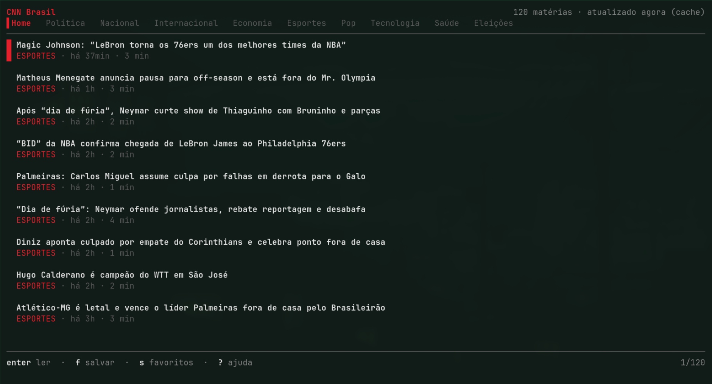

# cnnbr

Leitor de terminal para o [cnnbrasil.com.br](https://www.cnnbrasil.com.br), no
espírito do [circumflex](https://github.com/bensadeh/circumflex): as manchetes
numa lista, o texto inteiro no terminal, tudo pelo teclado.

O conteúdo vem do RSS da CNN, que expõe a matéria completa em
`content:encoded` — não há scraping de página, e o feed em cache faz a lista
abrir instantaneamente (inclusive offline).



## Seções

Uma aba por seção: Home, Política, Nacional, Internacional, Economia,
Esportes, Pop, Tecnologia, Saúde e Eleições. Cada seção busca o próprio feed
(`/feed/?cat=<id>`, que já inclui as subcategorias) e tem cache e posição de
leitura independentes — o carregamento é preguiçoso, só na primeira visita.

Dentro de uma seção, cada matéria mostra a editoria específica
(`BRASILEIRÃO`, `FUTEBOL`) em vez de repetir o nome da aba.

Quais seções aparecem e em que ordem se ajusta no painel (`c`) — quem nunca abre
Pop pode ocultá-la, e quem lê muito Economia pode colocá-la em `2`.

## Instalação

```sh
go install github.com/levyvix/cnnbr@latest
```

Ou, no clone:

```sh
go build -o cnnbr . && ./cnnbr
```

## Atalhos

| tecla | ação |
| --- | --- |
| `tab` `shift+tab` | próxima / seção anterior |
| `h` `l` `←` `→` | trocar de seção (na lista) |
| `1`…`9` `0` | pular direto para uma seção |
| `j` `k` `↓` `↑` | navegar na lista / rolar a matéria |
| `ctrl+d` `ctrl+u` | meia página |
| `g` `G` | início / fim |
| `enter` | abrir a matéria |
| `esc` `q` | voltar (na lista, sai) |
| `J` `K` | próxima / anterior sem sair do leitor |
| `o` | abrir no navegador |
| `y` | copiar o link |
| `f` | salvar nos favoritos |
| `m` | alternar lida / não lida |
| `s` | ver só os favoritos |
| `t` | alternar texto justificado |
| `c` | painel de preferências (na lista) |
| `espaço` | mostrar / ocultar a seção (no painel) |
| `J` `K` | reordenar as seções (no painel) |
| `r` | recarregar a seção atual |
| `?` | ajuda |

A roda do mouse também rola, tanto na lista quanto no leitor.

## Preferências

`c`, na lista, abre o painel de preferências: justificação, páginas do feed,
validade do cache, retenção do histórico de leitura e as seções, sem sair do
programa nem lembrar o nome de nenhuma flag.

O painel ocupa a área do corpo, com o cabeçalho e a barra de abas à vista.
`j`/`k` navegam, `h`/`l` (ou `espaço`) percorrem os valores de cada linha — que
são sempre uma lista fechada, nunca um campo de texto. Não há confirmar nem
descartar: cada mudança vale no momento da tecla, e `esc`, `q` ou `c` fecham e
gravam.

O grupo **Seções** lista todas as seções na ordem da barra de abas: `espaço`
mostra e oculta a que está sob o cursor, `J` e `K` movem ela para baixo e para
cima. O efeito aparece na barra de abas na hora, e a ordem escolhida governa
também `tab`/`shift+tab`, `h`/`l` e a numeração dos dígitos — `1` é sempre a
primeira aba da barra. Ocultar não joga nada fora: as matérias já carregadas, a
posição de leitura e o cache continuam lá, e reexibir não busca nada. A última
seção visível não pode ser ocultada.

Ocultar uma seção também tira as matérias dela da **Home**, que é o feed geral e
traz de tudo — a aba não sai da barra para a matéria reaparecer na primeira tela.
Matérias em caminhos que não são seção do leitor (`/lifestyle/`, `/auto/`)
continuam na Home: não há como ocultá-las.

Quando cada preferência passa a valer:

| preferência | vale |
| --- | --- |
| justificação, validade do cache | na hora |
| páginas do feed | na próxima busca (`r`, ou a primeira visita a uma seção) |
| retenção do histórico | na próxima execução |

As escolhas ficam em `$XDG_CONFIG_HOME/cnnbr/config.json`, que é JSON indentado
e pode ser editado à mão. Um valor que não esteja entre os predefinidos do
painel é exibido como é; o primeiro `h`/`l` salta para o predefinido mais
próximo.

## Opções

As flags sobrepõem o arquivo de preferências só naquela execução — são uma
sobreposição pontual, não a forma de configurar o programa. Os padrões abaixo
são os embutidos, usados quando não há arquivo.

```
-pages N      páginas do feed a buscar (padrão 2, 60 matérias por página)
-ttl D        validade do cache antes de buscar de novo (padrão 15m)
-justify      justificar o texto nas duas margens (padrão sim)
```

Mudar no painel sobrepõe o que veio de flag: a flag é o valor com que o
programa nasce, não uma tranca.

## Desenvolvimento

```sh
make test   # baixa o feed real para internal/feed/testdata/ e roda os testes
```

Os testes de formatação rodam contra um feed de verdade (todas as matérias, em
várias larguras de terminal). O arquivo não fica no repositório — sem ele, esses
testes são pulados em vez de falhar.

## Onde ficam os arquivos

- cache dos feeds: `$XDG_CACHE_HOME/cnnbr/feed-<seção>.json`
- lidas e favoritos: `$XDG_DATA_HOME/cnnbr/state.json`
- preferências: `$XDG_CONFIG_HOME/cnnbr/config.json`

Marcações de leitura com mais de 60 dias (o padrão) são descartadas na inicialização;
favoritos ficam para sempre. A retenção é ajustável no painel (`c`).
